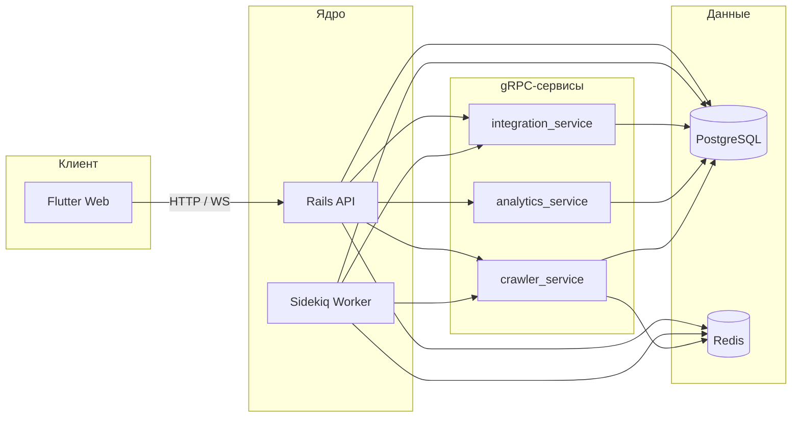

# Research Activity Monitoring System

Система мониторинга научной активности: веб-клиент на **Flutter**, API на **Ruby on Rails**, фоновые задачи (**Sidekiq**), интеграции и аналитика на **Go** (gRPC), краулинг контента на **Python** (Crawl4AI, LLM через LiteLLM). Данные — **PostgreSQL**, очереди и кэш — **Redis**.

---

## Возможности

- Учёт исследователей, команд, достижений и связанных сущностей через REST API (`/api/v1/...`).
- Синхронизация с внешними источниками (ORCID, OpenAlex, GitHub) через отдельный integration-сервис; отчёты и аналитика через analytics-сервис.
- Поиск и извлечение публикаций/страниц с помощью crawler-сервиса (HTTP, PDF, опционально Playwright, настраиваемые лимиты и LLM).
- Real-time уведомления через **Action Cable** (`/cable`).
- Развёртывание одной командой через **Docker Compose**; health-эндпоинты для оркестрации.

---

## Архитектура



| Компонент | Стек | Назначение |
|-----------|------|------------|
| `frontend/` | Flutter 3.x | Веб-интерфейс |
| `backend/` | Rails 7, Puma, Sidekiq | HTTP API, фоновые джобы, WebSocket |
| `integration_service/` | Go 1.25, gRPC | Внешние API (ORCID, OpenAlex, GitHub) |
| `analytics_service/` | Go 1.25, gRPC | Аналитика и отчёты |
| `crawler_service/` | Python 3, gRPC, Crawl4AI | Краулинг и извлечение контента |

---

## Требования

- **Docker** и **Docker Compose** (рекомендуемый путь для запуска всего стека).
- **Make** — для целей из корневого `Makefile`.
- Для локальной разработки без Compose: версии из `backend/Gemfile`, `frontend/pubspec.yaml`, `integration_service/go.mod`, `crawler_service/requirements.txt`.

---

## Быстрый старт (Docker)

1. Скопируйте переменные окружения и заполните секреты:

   ```bash
   cp .env.example .env
   ```

   Обязательно задайте как минимум `DB_PASSWORD` и `SECRET_KEY_BASE` (подсказки в [.env.example](.env.example)). Для генерации ключа Rails: `openssl rand -hex 64` или `rails secret`.

2. Соберите и поднимите сервисы:

   ```bash
   make build
   make up
   ```

3. После первого запуска создайте схему и при необходимости данные:

   ```bash
   make db-migrate
   make db-seed
   ```

4. По умолчанию (см. `.env.example`):

   - API: `http://127.0.0.1:3000`
   - Веб-клиент: `http://127.0.0.1:8080`

Проверка готовности: `GET /health/ready` на backend и соответствующие `/health/ready` у gRPC-сервисов (внутри сети Compose).

Полезные команды: `make ps`, `make logs`, `make shell` (bash в контейнере backend), `make down`.

---

## Конфигурация

Полный перечень переменных, портов, таймаутов gRPC, настроек краулера и Redis — в **[.env.example](.env.example)**. Ключи LLM и параметры провайдера для краулера задаются через приложение (настройки в UI).

---

## Тесты и покрытие

| Цель | Описание |
|------|----------|
| `make test-backend` | RSpec в изолированном профиле Compose (отчёт: `backend/coverage/`) |
| `make test-crawler` | `pytest` в `crawler_service/` |
| `make test-integration` | `go test` для `integration_service/` |
| `make test-analytics` | `go test` для `analytics_service/` |
| `make test-all` | Все suite подряд + сводка в `coverage_summary.txt` |
| `make serve-coverage` | Локальный просмотр HTML-отчётов покрытия |

---

## Структура репозитория

```
research_activity_monitoring_system/
├── backend/              # Rails API, Sidekiq, миграции
├── frontend/             # Flutter-приложение
├── integration_service/  # Go gRPC — интеграции
├── analytics_service/    # Go gRPC — аналитика
├── crawler_service/      # Python gRPC — краулер
├── scripts/              # Вспомогательные скрипты
├── docker-compose.yml    
├── Makefile              # Сборка, БД, тесты
└── .env.example          # Шаблон конфигурации
```

---

## API

Базовый префикс: **`/api/v1/`**. Ресурсы включают исследователей, команды, достижения, типы/статусы, отчёты, синхронизации, настройки. Полная схема маршрутов: [backend/config/routes.rb](backend/config/routes.rb).

---
